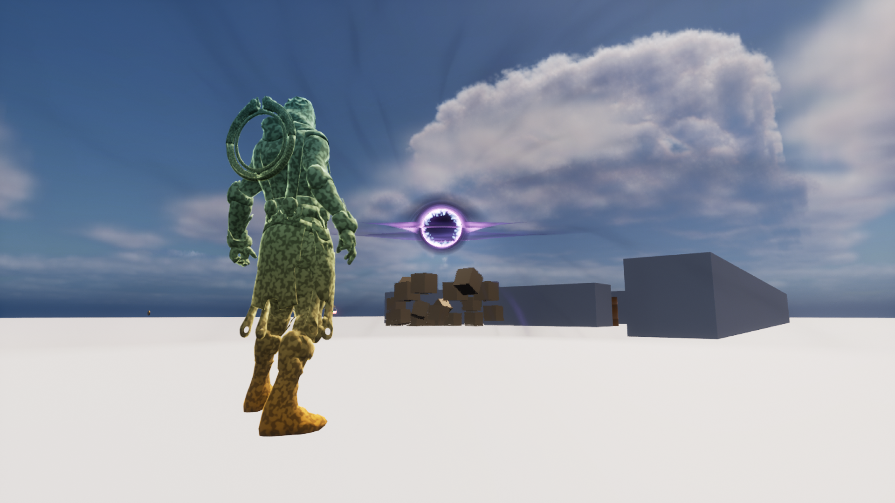
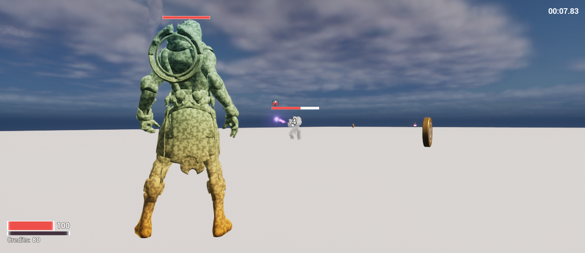
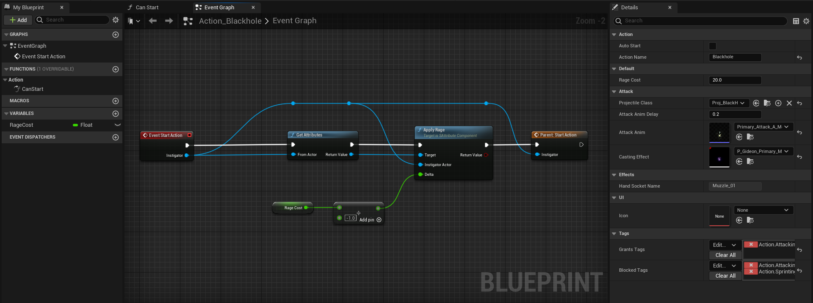
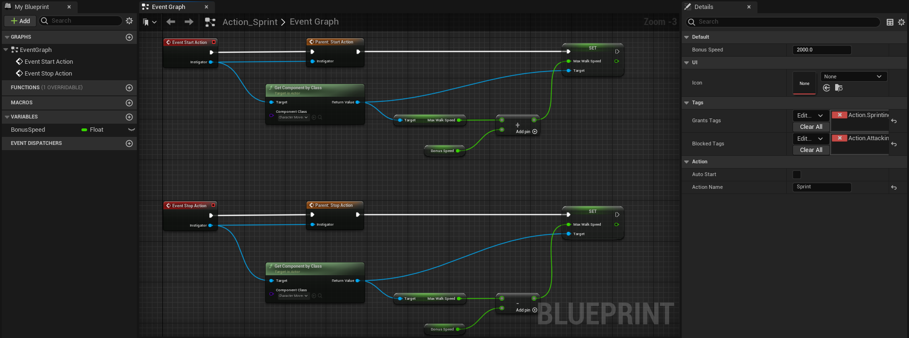
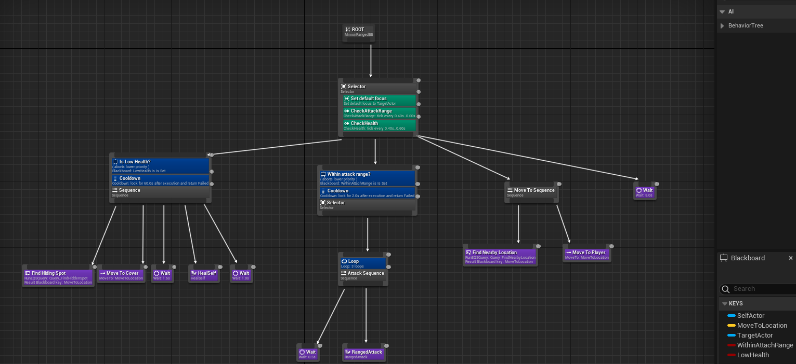
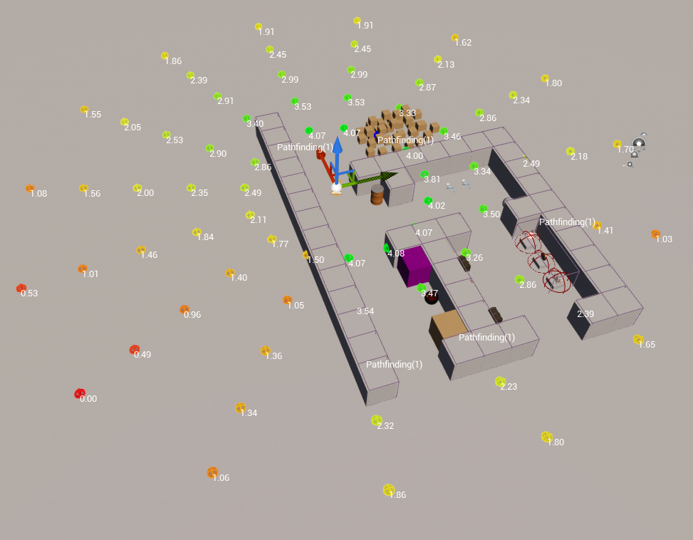
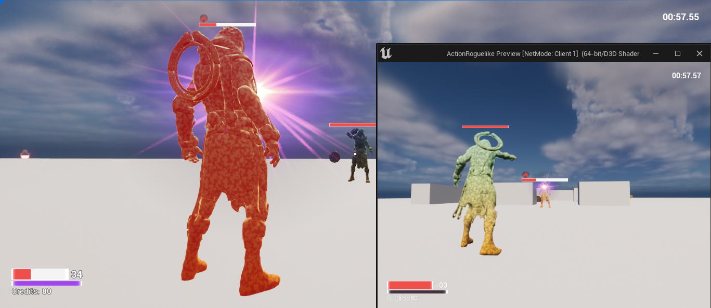

# ActionRoguelike

## 🛠 Skills 
- [x] Building C++ Game Framework
- [x] Combining C++ and Blueprint for flexible game logic
- [x] Unreal’s Gameplay Systems
- [x] Event-based Programming Principles
- [x] AI Programming (Behavior Trees, Blackboard, EQS, Custom C++ Nodes)
- [x] Multiplayer Networking (Replication architecture, low-bandwidth, best practices)
- [x] Saving Game State to Disk (Saving/loading player progression and world state)
- [x] Performance Profiling Tools (Unreal Insights & in-editor tools)
- [x] User Interfaces with UMG (using Event-based Principles)
- [x] Async Asset Loading & Soft References

## Gameplay Framework

## Gameplay Ability System Action|Effect

## AI Behavior Tree with custom Task|Service

## EQS Best HiddenSpot

## Multiplayer

